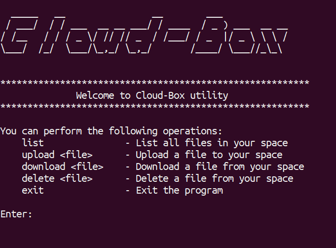

# Cloud-Box

Cloud-Box is a cloud based storage utility, powered by Amazon S3. It allows users to manage files within their designated space in the S3 bucket using CLI.

## Features

- `List` all files in the user's space within the S3 bucket.
- `Uploads <file>` to the user's space in the S3 bucket.
- `Downloads <file>` from the user's space to current local dir.
- `Delete <file>` from the user's space in the S3 bucket.



## Prerequisites

Before using Cloud-Box, ensure the following:

- AWS CLI is installed on your local machine.
- AWS CLI is configured with the default profile, which includes appropriate permissions to access the S3 bucket.
- You have the AWS Access Key ID and Secret Access Key configured with the default profile.

## Setup

1. **Clone the repository:**

   ```bash
   git clone <repository-url>

2. **Export the S3 bucket name as an environment variable:**

    ```bash
   export BUCKET_NAME=<your-bucket-name>
   ```
    Alternatively, you can modify the script `cloud-box` to hard code the bucket name.

## Usage

Run the script cloud-box to start Cloud-Box:

    ./cloud-box

The program will run in an infinite loop until you enter exit or press Ctrl+C.

## Notes

* Each user's files in the S3 bucket are prefixed with their AWS user ID.
* Ensure that you have permissions to perform operations on the specified S3 bucket and that the bucket name is correctly configured or exported.
* Protect sensitive information such as AWS credentials and bucket names.